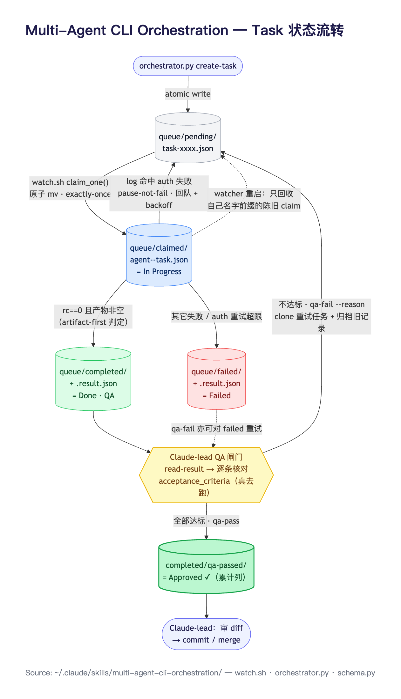
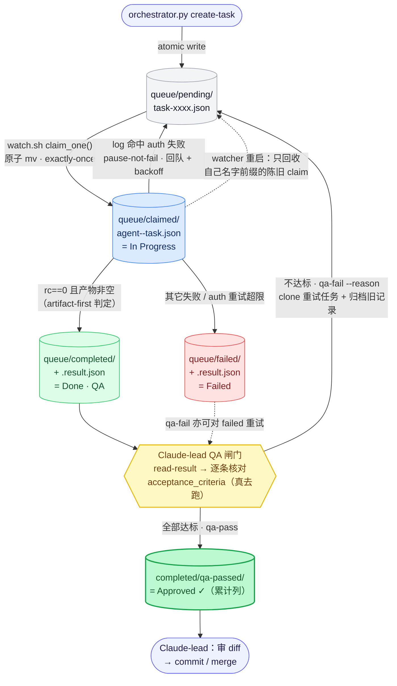

# Multi-Agent CLI Orchestration — Task 状态流转

> `multi-agent-cli-orchestration` skill 中，task 的"状态"就是它所在的**队列目录**——目录本身是状态机，迁移靠**原子 `mv`（`rename(2)`）**。没有中央调度器、没有 server，整套系统因此是 crash-only：任何时刻把四个目录数一遍就是完整真相。



---

## 状态流转图（Mermaid）



---

## 状态流转图（ASCII，终端友好）

```
                          orchestrator.py create-task
                                    │  (atomic write)
                                    ▼
                          ┌───────────────────┐
                          │  queue/pending/    │   task-xxxx.json
                          └─────────┬─────────┘
                                    │
                   watch.sh claim_one()  ← 原子 mv (rename 系统调用)
                   多个 worker/实例竞争，只有一个赢
                                    │  pending/x.json → claimed/<agent>--x.json
                                    ▼
                          ┌───────────────────┐
                          │  queue/claimed/    │   codex--task-xxxx.json   (= In Progress)
                          └─────────┬─────────┘
                                    │
                  worker 跑 native CLI，写 output_file
                  process() 判定（artifact-first）:
                                    │
            ┌───────────────────────┼───────────────────────┐
            │ rc==0 且产物非空        │ 命中 AUTH_FAIL_RE       │ 其它失败
            ▼                       ▼                        ▼
   ┌─────────────────┐   ┌──────────────────────┐   ┌─────────────────┐
   │ queue/completed/ │   │  requeue_auth()       │   │  queue/failed/   │
   │  + .result.json  │   │  pause-not-fail:      │   │  + .result.json  │
   │  (= Done · QA)   │   │  回 pending、计数+1、    │   │  (= Failed)      │
   └────────┬────────┘   │  backoff 等 token 刷新   │   └────────┬────────┘
            │            │   ──► 回到 pending ──┐   │            │
            │            └──────────────────────┘   │            │
            │                  (重试超限才 → failed)              │
            │                                                    │
   ╔════════╧═══════════════ Claude-lead 的 QA 闸门 ═════════════╧═══════╗
   ║  orchestrator.py read-result <id>  → 逐条核对 acceptance_criteria    ║
   ║  （可执行的真去跑：跑测试、跑 import，不靠肉眼）                          ║
   ╚════════╦═══════════════════════════════════╦═══════════════════════╝
            │ 全部达标                            │ 不达标
            ▼                                    ▼
   ┌──────────────────────────┐    orchestrator.py qa-fail <id> --reason "..."
   │ completed/qa-passed/      │              │
   │  spec + result 都迁入      │    ① clone 成新 pending 任务（带 retry_reason，派回同一 agent）
   │  (= Approved ✓ 累计列)     │    ② 旧 spec + result 归档到 <state>/archive/
   │  qa-pass <id>             │              │
   └──────────────────────────┘              └──► 回到 pending（闭环，直到达标）
            │
            ▼
   Claude-lead 审 diff → commit / merge（唯一掌控版本控制的角色）
```

---

## 迁移语义

| 迁移 | 触发 | 机制 |
|---|---|---|
| `(无)` → `pending` | `create-task` | `_atomic_write`（先写 `.tmp` 再 `rename`）|
| `pending` → `claimed` | worker 抢占 | **原子 `mv`**，并发下 exactly-once；文件名加 `<agent>--` 前缀 |
| `claimed` → `completed` | rc==0 且产物非空 | **artifact-first**：先看产物存在，再看 log，避免把含 "401" 的合法交付误判 |
| `claimed` → `pending`（自愈）| log 命中 auth 失败 | **pause-not-fail**：回队 + 计数 + backoff，token 刷新后自动续 |
| `claimed` → `failed` | 其它失败，或 auth 重试超限 | 写 `.result.json` sidecar |
| `completed` → `completed/qa-passed` | `qa-pass` | spec + result 一起迁入，进入累计 Approved 列 |
| `completed`/`failed` → `pending`（重试）| `qa-fail --reason` | clone 新任务带 reason + 归档旧记录到 `archive/` |
| `claimed` → `pending`（崩溃恢复）| watcher 重启 | 只重排**自己名字前缀**的陈旧 claim，不碰别人的 |

---

## 三个设计要点

1. **没有中央调度器**：状态 = 目录，迁移 = `mv`。整个生命周期由文件系统的原子 `rename(2)` + 几个 shell/python 脚本驱动，所以系统 crash-only——四个目录数一遍即真相。

2. **两条"回到 pending"的边来源不同**：**auth 自愈**（机器层瞬时故障，worker 自处理）与 **QA 重试**（质量层不达标，leader 处理）被刻意分到两个角色 / 两套机制——worker 负责"能不能跑完"，leader 负责"跑得对不对"。

3. **`qa-pass` 迁到独立 `qa-passed/` 而非原地打标**：让看板的 **Approved 累计列**与 **live 队列**物理分离——完成的活留在视野里体现进度，而不是 `qa-pass` 后消失，让长项目显得"空"。

---

*Source: `~/.claude/skills/multi-agent-cli-orchestration/` — `watch.sh`（claim/process/requeue_auth）、`orchestrator.py`（create-task/qa-pass/qa-fail）、`schema.py`（TaskSpec/TaskResult）。*
